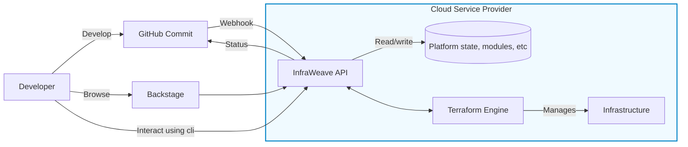

# InfraWeave Platform

> *Seamless, serverless infrastructure-as-code for modern platform teams*

    

  
  
  

---

InfraWeave combines the power of **Terraform**/**OpenTofu** with a **Kubernetes‑inspired developer experience**—that runs completely in your own cloud. It is completely **serverless & cost‑free when idle**, meaning you can have it available in every account and region, ready to spin up infrastructure within seconds.

## ✨ Why InfraWeave?

| Pain                                                        | InfraWeave solution                                                                              |
| ----------------------------------------------------------- | ------------------------------------------------------------------------------------------------ |
| **Platform team overloaded** fielding one‑off infra tickets | Self‑service **Modules** and **Stacks** available for any app team to deploy via pull requests.   |
| **Complex Terraform codebases** hard to onboard new devs    | **Straight-forward Manifests** `kind: S3Bucket`‑style claims hide Terraform internals.        |
| **Costly control planes**                                   | 100 % **serverless** tailored to each Cloud Service Provider (CSP). Pay \$0 when idle.                   |
| **Resources drift silently**                              | Built‑in **drift detection** + webhook alerts                            |
| **No single pane of glass for infra**                              | Visualize all Deployments and Modules in a unified interface                            |
| **Fragmented tooling**                                      | One platform, multiple ways to use **CLI**, **Python SDK**, GitHub‑native workflows, or a K8s controller. |

## 👤 Who is InfraWeave for?
* **Internal platform teams** offering golden-path infrastructure modules to application squads.
* Cloud-native teams that want Git-driven, serverless Terraform without running another control plane.

## 🚀 Features at a Glance

* **Stacks**: bundle multiple module claims into reproducible application blueprints.
* **Kubernetes‑style CRDs**: simple YAML like `kind: VPC` or `kind: Postgres`.
* **Zero‑ops**: deployed as AWS Lambda / Azure Functions + serverless DB & storage.
* **GitOps first**: PR‑driven plans & applies, surfaced as GitHub check‑runs.
* **Backstage plugin**: read‑only catalog of Modules, Stacks, deployments & drift.
* **Security by isolation**: central control account, per‑workload account.
* **Versioned everything**: semantic version bumps with upgrade plans in PRs.
* **Multi‑cloud**: today **AWS** (alpha) & **Azure** (in progress) – **GCP** coming.
* **Built in Rust** 🦀 for performance and safety.

## 🌍 Supported Providers

| Provider          | Status              |
| ----------------- | ------------------- |
| **AWS**           | 🧪 Beta             |
| **Azure**         | 🚧 Alpha            |
| **GCP**           | 🗺️ Planned End 2025 |
| **OCI**           | Not planned in near future |
| **Alibaba Cloud** | Not planned in near future |

## 🤝 Contributing

We want contributors! Check out [CONTRIBUTING.md](https://github.com/infraweave-io/infraweave/blob/main/CONTRIBUTING.md) to learn how to add value!

All contributors must follow our [Code of Conduct](https://github.com/infraweave-io/infraweave/blob/main/CODE_OF_CONDUCT).

## 📚 Learning & Community

* **Docs** – [https://preview.infraweave.io/core-concepts/overview/](https://preview.infraweave.io/core-concepts/overview/)
* **Discussions** – [https://github.com/orgs/infraweave-io/discussions](https://github.com/orgs/infraweave-io/discussions)

## 🪪 License

InfraWeave is licensed under the **Apache 2.0** license. See [LICENSE](LICENSE) for details.

---

InfraWeave is not affiliated with HashiCorp, Terraform, the CNCF, or Kubernetes. All trademarks belong to their respective owners.
